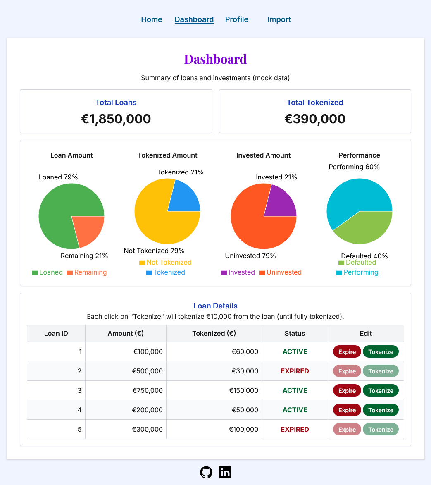

# Credit Institutions Implemented & Improvements


## Links
- [Demo](https://loan-tokenization-dashboard.vercel.app) - You can also explore the live demo here
- [GitHub](https://loan-tokenization-dashboard.vercel.app) - 
Currently private, but I can share access or make it public
- [Portfolio](https://yoko-portfolio-kappa.vercel.app/) - 
More projects demonstrate usage of APIs, unit tests, and Storybook

## General
### Implemented
- Easy documentation (this)
- Started this project as a clone of my old [boilerplate](https://github.com/kizuyoko/boilerplate-react-nextjs-typescript-tailwind)
- GitHub repository set up
- Simple Styling
- Page: Home, Dashboard, Profile, Import
- Vercel deployment

### Improvements
- Implement a design system & consistent CSS
- Responsive Design (especially Dashboard), Dark mode, and animation
- Add unit tests / Storybook stories
- Connect all pages to real API
- Add error handling for API calls
- Devide GitHub branches by features

## Home / Log in
### Implemented
- Simple landing page with buttons to Dashboard, Profile, and Import

### Improvements
- Add login functionality (currently only an intro page)
  - Mock login form with state toggle for login/logout
  - Future: connect to real authentication API, add validation and feedback messages

## Create profile
### Implemented
- Forms with React Hook Form
- Simple validation for required fields, numbers, and URLs
- Input fields display success/error states

### Improvements
- Better UX feedback (ex. tooltips)
- Possibly integrate with backend API for real-time validation

## Import
### Implemented
- Simple page to upload a file.

### Improvements
- Display success/error feedback
- CSV preview before upload
- Mock upload endpoint (upload-csv)

## Dashboard
### Implemented
- Total imported loans and tokenized loans displayed with cards
- Charts implemented with Recharts
- Table displaying loan details
- Mock loan data
- Buttons to update each loan's status (Expire, Tokenize)

### Improvements
- Add invested amount (currently assuming totalInvested = totalTokenized)
- Use Redux Toolkit to manage loan state globally, connecting LoanTable, Cards, and Charts

# Getting Started

First, clone the repository:

```bash
git clone https://github.com/kizuyoko/boilerplate-react-nextjs-typescript-tailwind.git
cd boilerplate-react-nextjs-typescript-tailwind
```
Then, install dependencies and start the development server:

```bash
npm install
npm run dev
# or
yarn
yarn dev
# or
pnpm dev
# or
bun dev
```

Open [http://localhost:3000](http://localhost:3000)  in your browser to see the app running.

You can start editing the page by modifying `app/page.tsx`. The page auto-updates as you edit the file.
